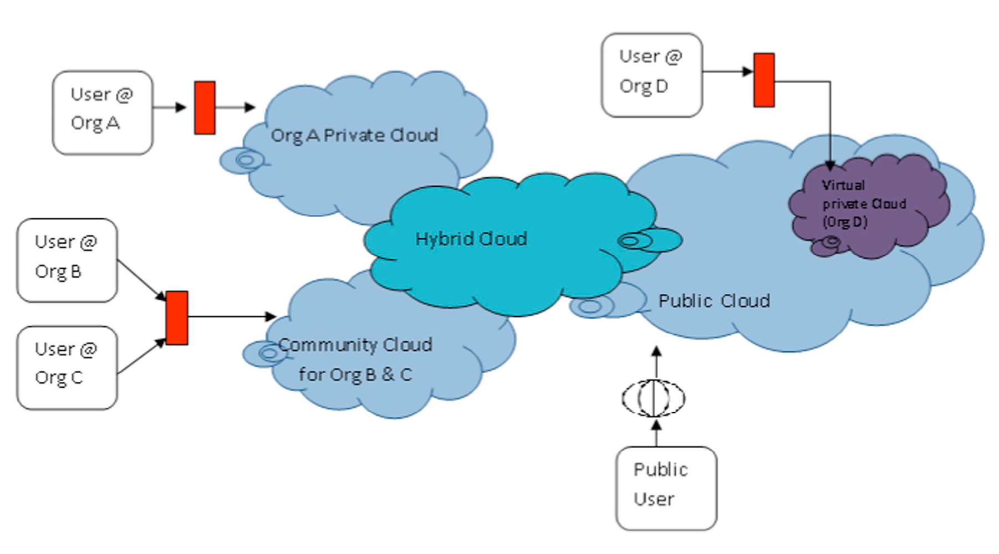
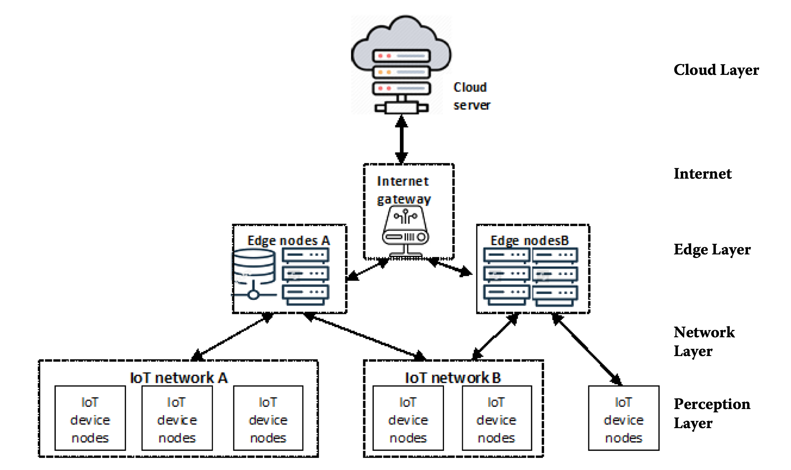
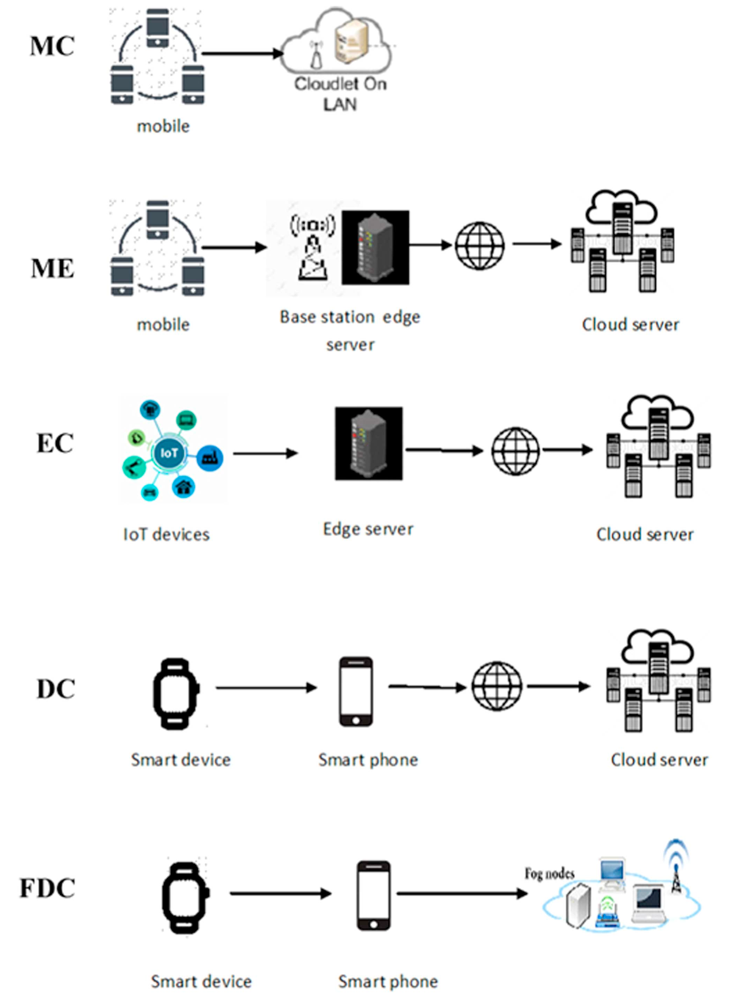
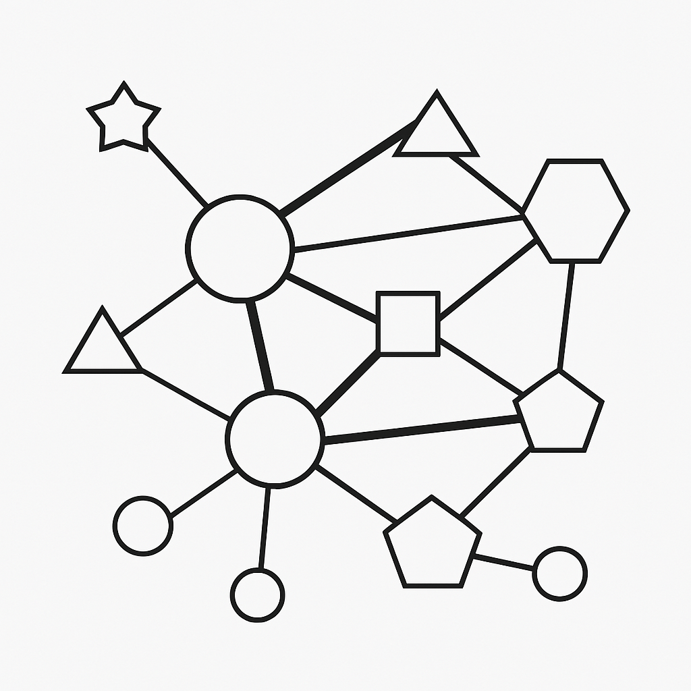

# 1.3.1 计算架构

以下是关于云计算、边缘计算和端计算的对比表格：

| **特性**     | **云计算**                                                   | **边缘计算**                                                 | **端计算**                                                   |
| :----------- | :----------------------------------------------------------- | :----------------------------------------------------------- | :----------------------------------------------------------- |
| **定义**     | 通过互联网提供计算资源（如服务器、存储、数据库等）的服务，数据集中在远程数据中心处理。 | 将计算能力下沉到靠近数据源的网络边缘（如基站、路由器等），在本地或附近处理数据。 | 计算直接在终端设备（如手机、电脑、传感器等）上完成，数据无需上传到云端或边缘节点。 |
| **特点**     | - 集中式处理 - 资源弹性扩展 - 依赖网络传输 - 适合大规模数据处理和复杂计算。 | - 分布式处理 - 靠近数据源 - 低延迟 - 适合实时性要求高的场景。 | - 完全本地化处理 - 不依赖网络 - 适合隐私要求高或网络条件差的场景。 |
| **优点**     | - 资源丰富，适合大规模计算 - 易于管理和维护 - 成本相对较低（按需付费）。 | - 低延迟，响应速度快 - 减少网络带宽压力 - 数据隐私性较好。   | - 完全离线，隐私性极佳 - 响应速度最快 - 不依赖网络稳定性。   |
| **缺点**     | - 依赖网络，延迟较高* - 数据隐私风险较大 - 不适合实时性要求高的场景。 | - 计算资源有限 - 部署和维护成本较高 - 不适合大规模数据处理。 | - 计算能力受设备限制 - 数据难以共享和协同处理 - 设备资源有限。 |
| **适用场景** | - 大数据分析 - 人工智能训练 - 企业级应用（如ERP、CRM）。     | - 物联网（IoT） - 自动驾驶 - 实时视频处理。                  | - 个人设备应用（如手机APP） - 隐私敏感场景（如医疗数据）。   |

- **云计算**：适合大规模、复杂计算，但依赖网络，延迟较高。

  

- **边缘计算**：适合低延迟、实时性要求高的场景，但资源有限。

  

- **端计算**：适合隐私要求高或网络条件差的场景，但受设备性能限制。

有许多不同的计算架构，包括但不限于：移动云计算、移动边缘计算、露计算、雾-露计算。

 

组合计算的架构：

在组合计算的架构里，第一视角不再是区分云、边、端等不同的网络和不同的设备。在组合计算网络里，每一个具有计算能力的节点被认为是具有不同能力的资源，网络是具有不同带宽和速度的数据管道，任务的完成以最优化全网络资源分配的基本原则完成。

组合计算的架构十分简单，是非中心化的计算资源网络架构。
