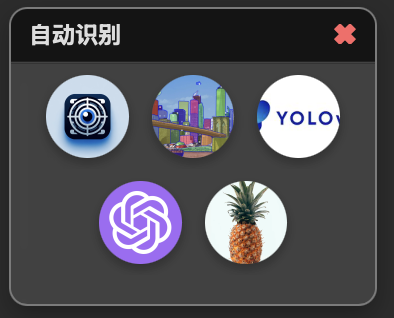
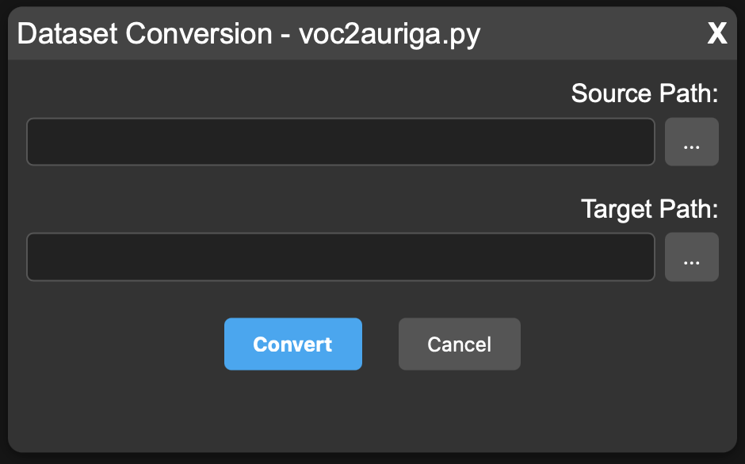

# 数据标注

`数据标注`（Annotation）是指对数据进行打上标签，以用于训练机器学习模型。例如：

- 标注物体照片，例如猫和狗；
- 给句子中的词汇标注词性；
- 标记电子邮件中的垃圾邮件；
- 在视频中为物体绘制边界框。

在大规模机器学习任务中，注释是不可或缺的，尤其在以下方面：

**监督学习** – 大多数机器学习模型依赖标注（注释）数据进行学习。

**准确性与性能** – 注释质量越高 → 训练效果越好 → 模型表现越出色。

**偏差减少** – 高质量、具有多样性的注释数据有助于模型做出更公平的预测。

**可解释性** – 注释示例有助于人类理解模型的学习过程。

在 CantorAI Design Studio 中，我们提供了几个关键的标注功能。

#### **标注工具**

Galaxy 提供强大的标注工具和自动化功能，简化基于视觉的标注流程：

- **手动标注**：
  - 提供工具，用于手动标注对象和执行分割。

- **自动标注流水线（Auto-Annotation Pipeline）**：
  - 使用预训练的视觉模型自动完成标注。
  - 利用先进的 **LLM（大语言模型）视觉模型**，检测并识别未标注的对象。
  - 通过手动调整和更新迭代优化标注结果。

---

在CantorAI Design Studia的标注页签，提供了大量有关标注的工具。

## 图像数据标注

[在CantorAI Design Studia的标注页签，提供了图像标注功能。](image-annotation.md)

## 自动化标注

在CantorAI Design Studio里，预先集成了多个可以用于进行自动化标注的模型，比如：

- detectron2
- Sam
- YoloV8

等机器学习模型。

在Cantor AI Design Studio的“标注”页打开一个图像文件，点击“自动识别”窗口中的模型图标，系统将根据已选模型对当前图像自动完成对当前图像的标注。

## 数据集格式转换

不同系统使用的标注软件使用不同格式的标注数据。CantorAI Design Studio 提供格式转换工具。比如，从voc转换为auriga格式，或反之。

