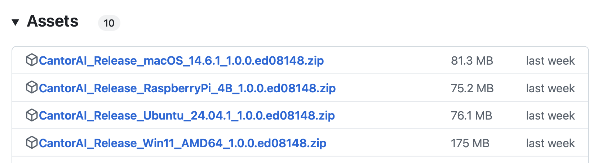

# 安装CantorAI

CantorAI组合计算框架支持多种机型、多种操作系统。安装了CantorAI计算框架的计算机可以跨操作系统、跨网络地相互连接，方便地组合形成一个算力和计算资源P2P网络。在任何一个节点发起的计算任务，都将由CantorAI计算框架的分布式任务分配根据对任务对计算资源的需要，优化分配给Cantor网络里的符合要求的节点。

在不同的操作系统里，如Windows、Linux、MacOS以及树莓派的Raspberry Pi OS等系统，都可以方便简单地安装CantorAI。用户只需要将CantorAI提供的相应安装包下载解压即可完成安装。

CantorAI的安装非常简单。不过，用户也可以使用Docker，安装包括CantorAI和Detectron，Yolo等模型和算法的机器学习工作环境，
