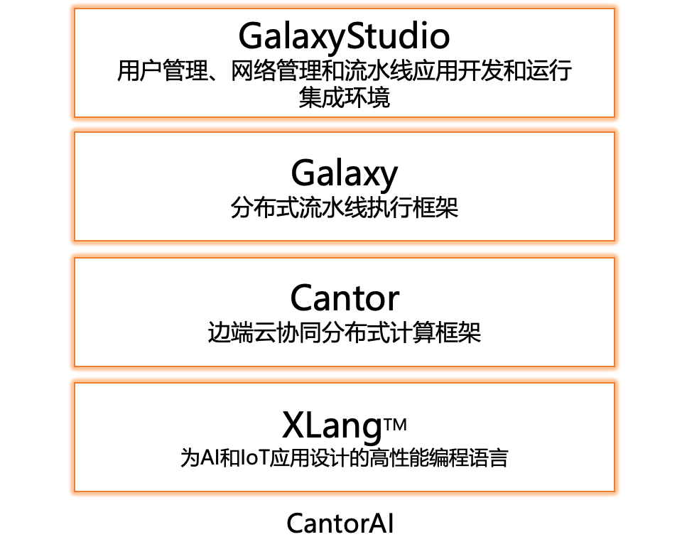

# 1.4.2 CantorAI平台的技术方案

CantorAI 平台包括三个核心组件——**XLang**、**Cantor** 和 **Galaxy**，并提供 **Galaxy Studio**，一个用于分布式平台管理的统一界面。**CantorAI 平台**通过抽象和统一管理计算资源和计算网络，降低分布式系统复杂性，并将算力与特定应用程序解耦的新编程模型来解决这些挑战。通过将数百或数千台机器的计算资源统一到一个共享的池中，CantorAI 允许多个项目高效地使用相同的基础设施。开发人员可以像在单台机器上运行一样编写分布式应用程序，简化了开发、最大化了计算资源利用率，并加速了 大规模分布式计算和AI 应用程序的开发、部署和运维。

CantorAI 平台概述
-------------

CantorAI 平台集成了三个核心组件：

1. **XLang**：一种高性能、类 Python 的编程语言，专为分布式和嵌入式系统设计。

2. **Cantor**：一个无中心的分布式计算平台，管理动态任务调度、资源分配和跨集群的安全通信。

3. **Galaxy**：一个分布式流水线执行框架，允许在异构环境中设计和管理工作流。

这些组件共同体现了**组合计算（Compositional Computing）**的概念，支持松耦合但高度集成的工作流，根据资源可用性和应用需求动态适应。这种方法将算力与应用程序分离，允许组织独立于特定项目来构建和管理计算资源。

* * *

关键组件
----

### XLang：面向分布式计算的现代语言

尽管 Python 在 AI 开发中因其简单性和广泛的库支持而普及，但它存在一些限制，如全局解释器锁（GIL），这阻碍了多线程性能，以及由于其解释性导致的较慢执行速度。

**XLang** 通过提供以下功能克服了这些限制：

* **高性能**：即时编译（JIT）加速了代码执行，接近 C++ 等本机语言的速度。

* **原生多线程**：消除了 GIL，允许高效的并行处理，充分利用多核处理器。

* **易用性**：保持了类似 Python 的语法，降低了开发人员的学习曲线，支持快速开发。

* **无缝集成**：支持嵌入 C++、Python 和其他语言，灵活利用现有的库和工具。

* **直接硬件控制**：提供底层硬件访问，允许开发人员优化性能关键的代码部分。

XLang 的设计理念是提供 Python 的简单性，同时提供通常与低级语言相关的性能和控制。这使其成为 AI 时代开发高性能分布式应用程序的理想选择。

### Cantor：去中心化的分布式计算平台

**Cantor** 作为 CantorAI 平台的核心，为无需中央控制器的分布式计算环境提供了强大而灵活的支持。它引入了创新功能，解决了分布式计算的复杂性，使得管理大规模集群成为可能。

#### Cantor 的关键特性

1. **将算力与应用程序解耦**
   * **共享资源池**：Cantor 使组织能够独立于特定的应用程序或项目来构建计算资源。计算能力被聚合到一个共享池中，可根据需要供任何应用程序使用。

   * **最大化资源利用率**：通过将计算资源与应用程序分离，Cantor 防止了机器闲置和资源冗余。不同的项目可以共享相同的计算基础设施，降低成本并提高效率。

2. **P2P 集群网络**
   * **无中心节点的集群形成**：采用对等（P2P）架构，允许节点同时作为服务器和客户端。这消除了对中央服务器的需求，增强了可扩展性和容错性。

   * **多端口监听**：每个节点可以监听多个端口（目前支持 TCP），最大化连接选项并提高网络弹性。

   * **双向会话**：节点之间的连接是双向的，允许数据在两个方向上同时传输，优化了通信效率。

3. **动态集群组织**
   * **图结构和最小生成树（MST）**：将集群组织为图结构，使用 MST 来维护网络的同步。这种方法减少了通信开销，同时保持集群状态的最新。

   * **加权连接**：基于带宽、流量和数据传输量等因素对连接进行加权，确保网络利用率平衡，避免拥塞。

4. **零信任安全计算**
   * **基于令牌的安全性**：实现基于令牌的身份验证和加密，确保安全通信。节点和设备使用令牌进行身份验证，确保只有经过验证的实体才能参与集群。

   * **双向信任建立**：节点通过安全协议建立相互信任，防止未受信任的实体破坏集群操作。

5. **基于 DataFrame 的通信**
   * **核心机制**：**DataFrame** 是 Cantor 用于跨集群进行数据通信和交换的核心抽象。每个 DataFrame 携带源和目标地址，使其成为分布式通信的自包含单元。

   * **基于优先级的传递**：支持优先级级别（如 0、1、2），确保关键数据以最小的延迟传递。

   * **自动路由**：DataFrame 通过网络图中的最短路径自动转发，减少延迟并优化资源利用。

6. **资源管理**
   * **资源类型**：
     * **基于条件的资源**：通过表达式定义（如 `USBCamera == 1`），允许任务指定所需的条件。

     * **基于数量的资源**：可消耗的资源（如 `GPU = 1`），使用会减少可用性，动态管理。

   * **全局资源分类账（GRL）**：每个节点维护与集群同步的本地化 GRL 快照。这个分散的分类账提供了资源可用性的实时视图，支持高效的任务调度。

7. **任务调度和执行**
   * **动态任务调度**：任务根据资源表达式进行评估并相应调度。如果本地资源满足条件，任务将在本地运行；否则，它将被分配到合适的节点。

   * **零部署开销**：代码和依赖项在运行时自动传递到节点，消除了手动设置。

   * **任务工作者**：节点可以在线程模式或进程模式下执行任务，基于资源配置按需创建工作者。

8. **全局变量和键值存储**
   * **全局变量**：支持任何 XLang 数据类型的全局变量，在整个集群中维护。值更新会自动同步，变更事件会通知订阅者。

   * **键值存储**：每个节点维护一个集群范围可访问的键值存储，具有简单的 API（`Set`、`Get`、`Delete`），通过自动序列化和反序列化支持复杂数据类型。

9. **日志和指标**
   * **系统指标**：监控每个节点的系统级指标（如 GPU、CPU 使用率）。提供 API，用于在本地、XLang 和 Python 代码中定义自定义指标。

   * **集群范围访问**：指标可跨节点访问，支持集中监控和分析。

   * **日志**：日志存储在每个节点的本地，提供节点特定的调试信息。

10. **对象存储和消息队列**
    * **对象存储**：提供跨集群管理数据对象的分布式机制。对象具有唯一的 `objectId`，与其所有者的 `nodeId` 关联。任何节点都可以使用 `objectId` 查询或修改对象。

    * **消息队列**：支持为 XLang 数据类型创建、删除和管理队列。提供队列更新的事件驱动通知，使订阅者能够动态处理更改。

#### Cantor 的技术分架构优势

* **去中心化**：通过消除中央控制器，Cantor 减少了单点故障，增强了可扩展性。

* **灵活性**：节点可以动态加入或离开集群，系统实时适应。

* **高效性**：基于优先级的 DataFrame 传递和自动路由优化了网络性能。

* **算力与应用程序的分离**：Cantor 的架构允许独立于特定应用程序来管理计算资源。组织可以构建服务于多个项目的计算基础设施，避免了冗余设置和闲置机器。

* **安全性**：零信任模型确保了安全通信，防止未经授权的访问。

Cantor 的全面功能集和创新架构使其成为管理分布式计算环境的强大平台。通过将算力与应用程序分离，Cantor 最大化了资源利用率和灵活性，符合现代 AI 和 IoT 应用的需求。

### Galaxy：分布式流水线执行框架

**Galaxy** 是一个构建在 Cantor 之上的分布式流水线架构，管理跨异构环境的工作流。它通过支持松耦合的组件无缝协作，引入了**组合计算**的概念。

Galaxy 的关键特性包括：

* **分布式过滤器（Filters）**：处理封装为 DataFrame 的数据的模块化组件。过滤器可以具有多个输入和输出引脚，能够在集群中的任何节点上运行，基于资源条件动态分配。

* **灵活的连接**：
  * **任务连接（Task Connections）**：利用 Cantor 的任务调度器，将下游过滤器作为独立任务执行，传递 DataFrame 作为输入。

  * **强连接（Strong Connections）**：确保 DataFrame 在同一节点上的过滤器中处理，保持数据局部性，最小化通信开销。

  * **弱连接（Weak Connections）**：允许 DataFrame 在集群中的节点之间传递，支持分布式处理和负载均衡。

* **实时适应**：根据资源可用性和工作负载变化动态调整流水线执行，无需手动干预，确保最佳性能。

* **用户自定义过滤器**：开发人员可以通过继承 `galaxy.BaseFilter`，使用 XLang、Python、C++ 或其他语言创建自定义过滤器。这种灵活性允许集成广泛的功能，并重用现有的代码库。

* * *

Galaxy Studio：用于分布式平台管理的统一界面
----------------------------

虽然 Galaxy 提供了分布式流水线执行的后端，但 **Galaxy Studio** 提供了一个全面的**用户界面层**，将技术能力与用户友好的界面结合起来。它作为 CantorAI 平台的中心枢纽，用于设计、部署和管理分布式应用程序。

### Galaxy Studio 的关键特性

1. **可视化流水线设计**

   * **拖放界面**：通过允许用户直观地配置过滤器、连接和执行参数，简化了流水线的创建。用户无需编写代码即可轻松组装复杂的工作流。

   * **直观的连接管理**：用户可以定义连接类型（任务、强连接、弱连接），根据特定需求平衡性能和可扩展性。

   * **可重用组件**：鼓励模块化设计，允许在不同的流水线中重用过滤器，促进代码重用和一致性。

2. **项目管理**

   * **集中式仪表板**：提供所有项目的概览，包括配置、资源使用、部署状态和性能指标。

   * **版本控制**：跟踪更改，管理流水线和组件的不同版本，促进协作并保持一致性。

   * **协作工具**：支持多用户环境，允许团队同时协作处理项目。

3. **边缘和设备管理**

   * **Edge Hub 集成**：管理边缘设备和 IoT 节点的注册和监控，提供设备状态和性能的实时洞察。

   * **设备健康监控**：跟踪设备连接性、资源可用性和操作指标，确保集群的可靠运行。

   * **安全注册**：利用基于令牌的身份验证和加密，安全地将设备添加到集群中，确保零信任的安全态势。

4. **模型训练和集成**

   * **训练配置**：允许用户在平台内设置数据集、配置训练参数并启动训练任务。

   * **进度监控**：显示实时训练指标、损失曲线和性能可视化，帮助用户跟踪进度并做出明智的决策。

   * **自动部署**：将训练好的模型自动集成到流水线中作为过滤器，简化了部署过程，减少了投产时间。

5. **标注工具**

   * **手动标注**：提供用于手动标注和分割数据的工具，对于创建高质量的训练数据集至关重要。

   * **自动标注**：利用 AI 模型和大型语言模型（LLM）自动完成标注过程，提高效率和一致性。

   * **迭代改进**：支持反馈循环，系统从纠正和改进中学习，随着时间的推移提高模型的准确性。

6. **监控和调试**

   * **流水线执行跟踪**：监控 DataFrame 在流水线中的流动，突出性能瓶颈并支持优化。

   * **资源利用率**：提供有关 CPU、GPU、内存使用率和集群中其他资源的详细报告，帮助进行容量规划和扩展决策。

   * **调试工具**：提供逐步执行跟踪、断点和过滤器行为检查，简化了分布式应用程序的调试。

7. **统一的平台管理**

   * **跨组件集成**：与 Cantor 的调度和 XLang 的编程功能无缝集成，提供一个连贯的开发和部署环境。

   * **安全管理**：集中控制身份验证、授权、加密设置和租户隔离，加强安全治理。

   * **可扩展性控制**：允许管理员根据工作负载需求动态调整集群大小、资源分配和优先级设置。

### 提高可用性和生产力

Galaxy Studio 将分布式计算的复杂性转化为一个可访问的平台：

* **简化分布式编程**：开发人员可以专注于应用逻辑而非基础设施，使针对数千台机器的编程如同编写单台机器的程序一样简单。

* **加速开发周期**：快速的原型设计、测试和部署能力缩短了新应用和功能的上市时间。

* **赋能非技术用户**：业务分析师、数据科学家和领域专家无需深入的技术知识即可参与工作流设计和监控。

* **-促进协作**：统一的工具和界面促进了组织内不同角色和部门之间的团队合作。

* * *

相对于传统平台的优势
----------

### CantorAI 与 Ray.io 的比较

虽然像 Ray.io 这样的平台提供分布式计算能力，但 CantorAI 通过其针对 AI 和 IoT 应用的全面方法脱颖而出，引入了独特的功能，解决了传统平台的限制。

| **特性**                 | **CantorAI**                                                 | **Ray.io**                               |
| ------------------------ | ------------------------------------------------------------ | ---------------------------------------- |
| **分布式架构**           | 无中心、去中心化的平台，具有动态资源管理和组合计算。         | 集中式架构，去中心化特性有限。           |
| **算力与应用程序的分离** | 是的；计算资源独立于应用程序管理，允许项目间共享利用。       | 否；资源通常绑定到特定的应用程序或集群。 |
| **编程语言**             | XLang：高性能、类 Python 的语言，具有 JIT 编译和无 GIL 限制。 | 基于 Python，受 GIL 影响，执行速度较慢。 |
| **流水线执行**           | Galaxy 提供完全分布式的流水线，具有动态任务分配和实时适应。  | 需要手动配置流水线，缺乏动态适应。       |
| **AI 集成**              | 内置模型训练、自动标注和自动部署到流水线。                   | 依赖于外部库实现 AI 功能。               |
| **IoT 和边缘支持**       | 原生支持边缘设备和 IoT 节点，具有轻量级组件和可扩展性。      | 主要关注云集群，边缘支持有限。           |
| **任务调度**             | 具有零部署开销和组合计算的动态、资源感知调度。               | 静态或预定义的调度策略，需要手动部署。   |
| **开发者工具**           | Galaxy Studio 提供统一的界面，具有拖放设计、监控和调试工具。 | 没有专用的 GUI，依赖于基于代码的配置。   |
| **安全性**               | 零信任模型，具有基于令牌的身份验证和加密，支持租户隔离。     | 安全性依赖于外部配置，覆盖不够全面。     |

CantorAI 能够使分布式编程如同编写单台机器的程序一样简单，同时提供超级计算机级别的计算能力，使其区别于传统平台。其通过将算力与应用程序分离以及组合计算来最大化资源利用率，满足了现代 AI 应用的关键需求。

* * *

总结
--

CantorAI 平台代表了 AI 时代分布式计算的重大飞跃。通过引入**组合计算**并将算力与应用程序分离，它使组织能够构建可扩展、高效且灵活的系统。CantorAI 简化了分布式编程，使其如同编写单台机器的程序一样简单，将数千台机器的计算能力统一成一个有机整体。

通过其集成的组件——XLang、Cantor 和 Galaxy，以及用户友好的 Galaxy Studio 界面，CantorAI 提供了一个综合解决方案，解决了现代 AI 和 IoT 应用的复杂性。它最大化了资源利用率，加速了开发周期，使组织能够释放分布式计算的全部潜力。

随着 AI 应用的持续演进和对更大计算资源的需求，像 CantorAI 这样的平台将在推动创新和实现下一代技术进步方面发挥重要作用。