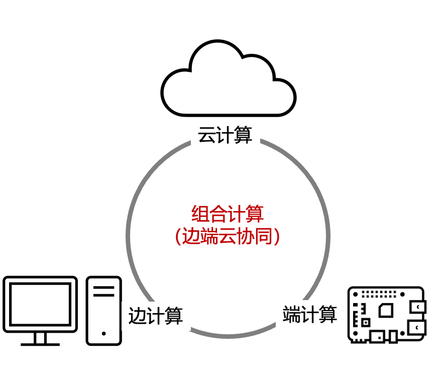

# 1.1 组合计算(Composition Computing)

AI 时代的特点是对计算资源和高效处理海量数据集的前所未有的需求。特别是涉及深度学习和实时数据处理的 AI 应用，需要分布式系统的集体力量来满足性能和可扩展性的需求。然而，编程和管理如此大规模的分布式系统带来了重大挑战。开发人员经常面临与网络通信、同步、资源管理和容错相关的复杂问题。

传统的分布式计算平台通常将算力直接与特定的项目或应用程序绑定。这导致了硬件部署的冗余、资源未充分利用以及运营成本的增加。组织可能会为每个项目构建专用的计算基础设施，导致机器闲置和效率低下。

我们希望提供一种新的计算技术架构，就是把边缘计算节点、云计算和IoT设备的算力无缝地组合在一起，为大规模的AI和IoT应用提供充足的算力。我们称之为`组合计算` `Composition Computing`。

`组合计算`是边端云协同计算为核心，对云端、边缘和末端IoT设备计算资源一视同仁。在互联网络上，建立起超强的**资源管理**和**任务调度**能力，最优化地完成大规模计算任务，**挖掘系统的整体计算潜力，显著提升网络中强力资源的使用效率，提升末端弱计算设备的功能，丰富大规模计算应用，解锁新的场景**。

`组合计算`不但是==一种新的计算架构，更是一种新的计算理念==。==计算将不再以云、边、端等计算所发生的位置等复杂的外界限制条件考虑问题，而是将整个算力节点群视为一张网络、根据计算任务的需要，统一地，优化地和动态地分配资源的角度分发和执行计算任务==，

下面，先让我们略微回顾，来横向看看云计算、边缘计算和IoT设备的计算架构和技术方案，以及计算重心在中心和边缘摇摆，同时越来越分布化的发展史。