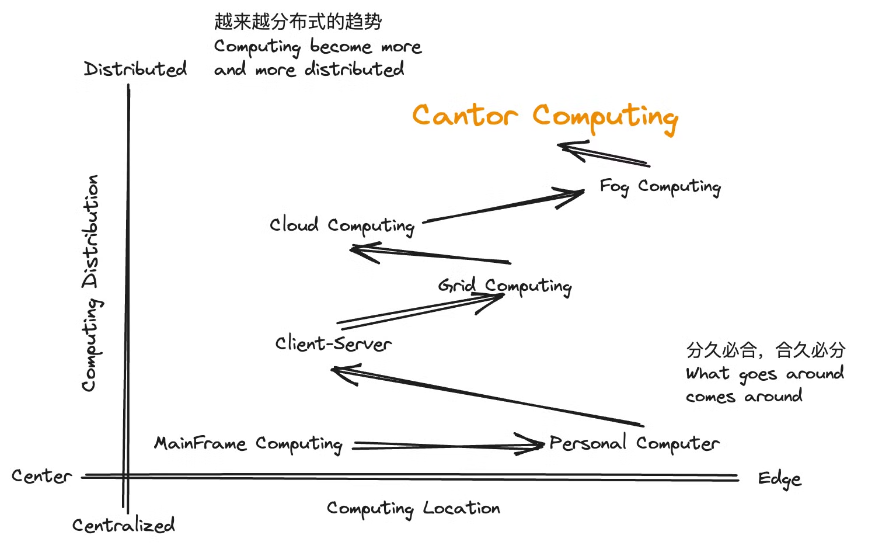

# 1.2 计算的发展

当我们回顾计算的发展历史，我们会看到，==计算的模式不断从集中式的计算向分布式的计算发展，计算网络的重心则在边缘和中心来回跳动。==

### 计算的集中和分布，边缘和中心

当我们说“`集中式计算`和`分布式计算`”，以及“`边缘计算`和`中心计算`”的时候，我们是在不同的维度进行分类。具体来说，这两个分类维度分别涉及计算资源的分布和计算任务的执行位置。

## 1. **集中式计算和分布式计算**

**分类维度：计算资源的分布**

- `集中式计算`（`Centralized Computing`）：
  - 计算资源集中在一个中央位置或少数几个数据中心。
  - 所有计算任务都由中央服务器或主机处理。
  - 例子：传统的大型机系统、早期的企业数据中心。
- `分布式计算`（`Distributed Computing`）：
  - 计算资源分布在多个地理位置不同的节点上。
  - 计算任务分散在多个节点上处理，节点之间协同工作。
  - 例子：网格计算、分布式数据库系统、分布式文件系统。

## 2. **边缘计算和中心计算**

**分类维度：计算任务的执行位置**

- `中心计算`（`Central Computing`）：
  - 计算任务主要在中央数据中心或核心位置执行。
  - 数据从边缘设备收集后传输到中心位置进行处理。
  - 例子：云计算中的数据处理、传统的企业数据中心。
- `边缘计算`（`Edge Computing`）：
  - 计算任务在靠近数据源头的位置（边缘节点）执行。
  - 数据在产生地或靠近产生地的位置处理，减少传输延迟和带宽消耗。
  - 例子：智能家居设备、工业物联网设备、自动驾驶汽车中的计算单元。

### 对比与总结

- **集中式计算 vs. 分布式计算**：这个维度关注的是计算资源如何组织和分布。集中式计算强调资源的集中管理和处理，而分布式计算强调资源的分散和协同工作。
- **中心计算 vs. 边缘计算**：这个维度关注的是计算任务的处理位置。中心计算将任务集中在核心位置处理，而边缘计算将任务分散到靠近数据源头的边缘节点处理。

这两个分类维度可以相互交叉和结合使用。在现代计算系统中，往往会结合使用这些计算模式。例如，云计算可以看作是中心计算与分布式计算的结合，而边缘计算与中心计算往往协同工作，以实现更加灵活和高效的计算系统。在这种结合中，分布式计算的节点可以既有边缘计算节点，也有中心计算节点，从而形成一个复杂而高效的计算生态系统。

| 典型计算场景       | 计算资源   | 计算位置 |
| ------------------ | ---------- | -------- |
| 传统企业数据中心   | 集中式计算 | 中心计算 |
| 智能家居           | 集中式计算 | 边缘计算 |
| 工业互联网         | 集中式计算 | 边缘计算 |
| 自动驾驶汽车计算   | 集中式计算 | 边缘计算 |
| 企业大语言模型应用 | 分布式计算 | 边缘计算 |

## 3. 计算发展简史

|                            | 资源组织和分布 | 计算任务的处理位置                 |
| -------------------------- | -------------- | ---------------------------------- |
| Main Frame（1950’s)        | 集中式计算     | 中心计算                           |
| 个人电脑(1970’s)           | 集中式计算     | 边缘计算                           |
| 网格计算（1990’s)          | 分布式计算     | 中心计算（虚拟）                   |
| 云计算（2000’s）           | 分布式计算     | 中心计算                           |
| 雾计算 （2010’s）          | 分布式计算     | 边缘计算（网关）                   |
| CantorAI组合计算（2020’s） | 分布式计算     | 边缘计算（任何计算设备）+ 中心计算 |

**分布式边缘计算的时代意义和价值**

在计算发展的历史基础上，以分布式边缘计算为核心的`组合计算` (`Composition Computing`)应运而生，解决AI和IoT时代所面临的大规模计算的问题：

- 各行各业需要AI算力以及昂贵、复杂的算力之间的矛盾。
- 打破云AI的技术垄断，捍卫数字资产和隐私，更快的计算、更小的时延。
- 分布式边缘技术创新可能引起计算基础设施的变革和产业的变革。
- 进一步地提高AI计算效率。
