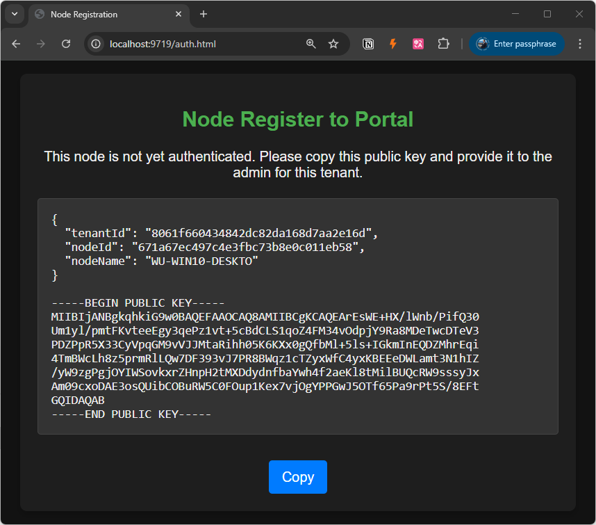
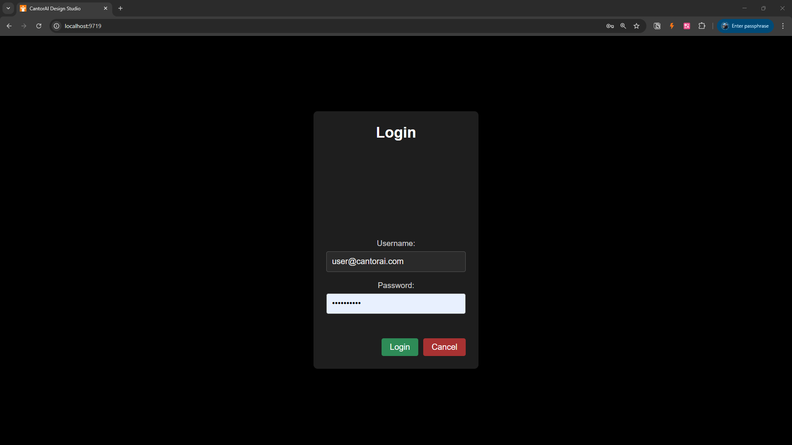

# 2.2 开始使用

CantorAI系统提供GUI工具和API编程接口。初次使用CantorAI系统，可以从使用其GUI工具（ `Galaxy Studio`）入手。

`Galaxy Studio` 是一个综合性的 GUI 工具，用于项目管理，资源和网络集群管理、设计、部署和运行分布式`流水线`、标注数据、训练模型等工作。

- **`流水线`设计**：
  - 提供拖放式界面，用于创建和配置由`过滤器`组成的流水线。
  - 支持直观管理连接类型（任务、`强连接`、`弱连接`）和`数据流`。

- **项目管理**：
  - 集中式仪表盘，用于管理流水线配置和部署。
  - 简化分布式工作流的协作和版本控制。

- **集群管理**：
  - 专用 GUI，用于管理边缘设备注册和集群配置。
  - 支持设备与边缘节点的关联，并提供实时设备状态监控。

- **设备中心（Device Hub）**：
  - 与 Edge Hub 集成，管理单个设备的状态和配置。

---

- 通过这个示例，你将能够首次登录 CantorAI 设计工作室，迈入 CantorAI 组合计算平台的世界大门。

  **相关概念说明：**
  **CantorAI 设计工作室（CantorAI Design Studio）：**
  这是一个前端工具，旨在通过简单的鼠标点击和少量键盘操作，帮助你轻松完成组合计算网络的大部分配置工作。它可以可视化你的网络资产及其组织结构，支持通过可视化的流水线构建机制来搭建应用程序，并可自定义仪表盘和监控系统级及应用级的各类指标。
  
  但请注意，CantorAI 设计工作室并不是一个用于完成所有开发任务的一体化平台。我们假设用户已经具备对 CantorAI 技术原理的基本了解。
  
  例：启动CantorAI Design Studio
  
  - 在装有Cantor计算框架的任意节点，执行Cantor命令，即可启动Cantor系统。在这个时候，在本机打开互联网浏览器（如chrome，Firefox等），在地址栏输入：https://localhost:9719，则可以运行本机的CantorAI Design Studio。
  
    - 第一次启动Cantor系统时，出于安全和许可证验证的要求，系统会要求您在CantorAI将该计算节点注册。您会看到以下界面。计算节点注册需要在CantorAI门户网站完成，详情请参考下一个[Node Authorization](node-registration.md)案例。
  
    
  
  - 当Node Authorization完成以后，再次打开https://localhost:9719 网址，会出现用户登录界面。
  
    
  
- 也可以在浏览器上输入任何一台其它联网节点的IP地址https://ip-address:9719，则可以访问它节点的CantorAI Design Studio。
