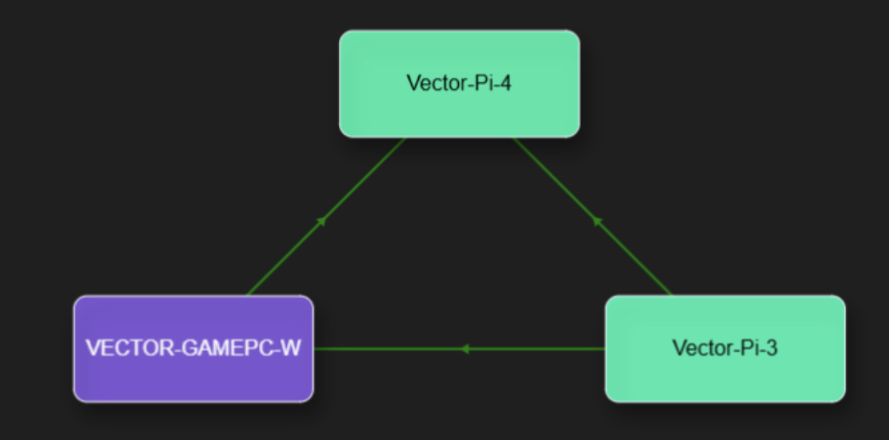

# 节点间的通信

在用户的网络集群上， 可以通过在CantorAI Design Studio上的通信的功能来验证节点之间的通信是否通畅。

比如，在节点1 https://ip-node1:9719启动CantorAI Design Studio并成功登录。使用在“集群”页签的信息发送功能向处在同一个集群的另外一个节点（IP地址 ip-node2）发送一个信息。当用户登录https://ip-node2:9719时，会看到“邮箱”里有信息在等待。

比如：某用户构建了以下三个节点构建的集群：

在pi-4节点上，点击pi-3节点，再点击Messaging按钮（界面右上角的信箱图标），在弹窗里，即可输入给pi-3节点的信息。(/Users/zonghuanwu/Library/Application Support/typora-user-images/image-20250501151507446.png)

登录pi-3节点的CantorAI Studio，在集群界面上右上角，可以看到，pi-4节点的信息已经收到。

:book: **基于 DataFrame 的通信**

**DataFrame** 是 Cantor 用于跨集群交换数据的核心机制，同时支持系统级数据传输和应用开发。

- **核心机制**:
  - DataFrame 封装了数据，并附带源节点和目标节点的元数据，作为自包含的分布式通信单元。
  - 它是系统级数据交换和自定义应用开发的核心。

- **性能优化**:
  - 支持基于优先级的传递（如优先级 0、1、2），确保关键数据以最低延迟传递。
  - 自动路由机制通过网络图中的最短路径减少通信开销。

- **开发者 API**:
  - 提供 API 用于创建、管理和传递 DataFrame，为开发者构建低级和高级应用提供灵活性。详见[相应的开发者API文档](apis/cantor/dataframe_apis.md)。
