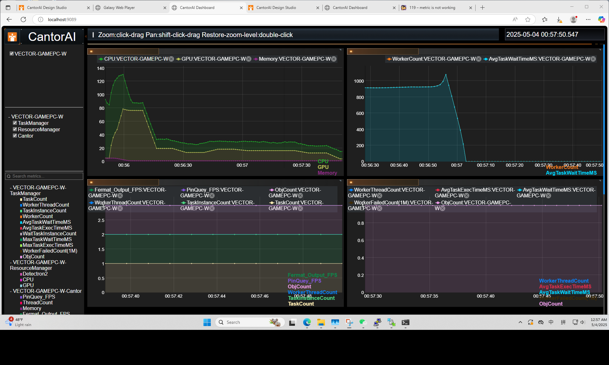

# 指标监控

#### CantorAI 的监控概述

CantorAI 提供强大的监控能力，旨在追踪整个系统，以及不同节点的性能。平台提供统一的仪表板，监控关键的任务性能指标，资源使用指标以及Cantor AI系统指标。如 GPU、CPU等资源的使用率、内存利用率，平均任务等待时间，流水线性能等。通过收集和分析来自所有节点的时间序列指标和日志，CantorAI 使用户能够维护系统健康，识别瓶颈，并动态优化 AI 应用。

### 监控界面

1. 在CantorAI Design Studio Piepleine页面，点击顶部菜单栏中的【监控按钮】。
2. 切换至【指标监控】界面。

#### 统一仪表板

CantorAI 提供一个集中的仪表板，用于可视化系统中的所有指标。该仪表板包括：

- **实时监控**：实时显示指标，帮助用户快速了解系统健康状况。
- **可定制视图**：用户可以根据需求创建自定义视图，聚焦于特定节点或资源指标，提高监控的精细度。

#### 资源类指标（System Metrics）

可监控内容：

| 指标名称         | 说明                              |
| ---------------- | --------------------------------- |
| CPU 使用率       | 显示每个节点的 CPU 实时占用率     |
| GPU 使用率       | 包括 GPU Memory 占用与温度等      |
| 内存使用         | 当前节点的物理内存占用情况        |
| 自定义资源使用率 | 如莫节点定义了Detectron算法资源   |
| 节点状态         | 在线/离线、任务运行数、负载等信息 |

>  所有节点由 Cantor 的资源调度模块统一采集指标并自动上传。

#### 任务指标（Task Metrics）

包括但不限于以下指标：

| 类型     | 示例                      |
| -------- | ------------------------- |
| 任务管理 | Task, Task Instance等指标 |
| 计算管理 | Worker，Thread等指标      |
| 效率管理 | 任务等待时间，运行时间等  |

#### 系统指标（CantorAI System Metrics）

包括但不限于以下指标：

| 类型         | 示例                   |
| ------------ | ---------------------- |
| 流水线管理   | Fermat过滤器帧率等指标 |
| 系统资源占用 | 系统内存占用等指标     |
|              |                        |

#### 3. 指标收集与存储

CantorAI 采用分布式方式收集和存储系统指标：

- **分布式时间序列收集**：时间序列指标和日志从集群中所有节点收集并以去中心化方式存储，确保高效的查询和实时分析。
- **日志和系统事件**：除了指标，CantorAI 还收集系统日志以便调试。日志存储在每个节点的本地，提供详细的调试信息。
