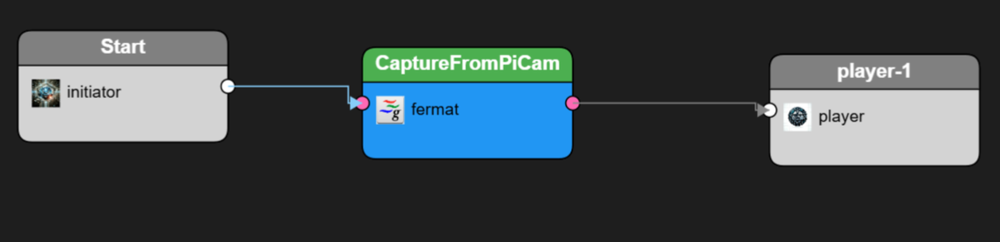

# 实时目标检测流水线（DetectFromPiCamMJPG 示例）

**案例描述**：该示例展现了如何构建一个实时视频流目标检测应用。数据源为树莓派摄像头（MJPG格式流），流水线对视频帧进行目标检测，并将结果叠加显示。

在 CantorAI Galaxy 实现中，主要组件和流程如下（对应 `DetectFromPiCamMJPG.yml` 文件）：

* **CaptureFromPiCam**：数据源过滤器，类型为 `fermat`（推测是用于接入GStreamer管道）。配置中 `uri: galaxy_fermat`，description 指定了一段 GStreamer 管道字符串，包括访问 `/dev/video0` 摄像头、JPEG编码以及 `galaxyrecvfilter id=0`。这表明 CantorAI 集成了 Fermat（一种多媒体流处理）模块，将摄像头帧作为 JPEG 数据帧注入 Galaxy 管道。该过滤器有一个输出引脚（format: JPEG）。

* **Duplicate**：分流过滤器，类型 `tee`（对应 `galaxy_forge` 模块中的 tee），具有1个输入引脚和2个输出引脚。它的作用是将摄像头帧复制成两份，通过两个输出引脚分别发送。这实现了一帧图像走两条不同的处理支路。

* **objectDetector**：目标检测过滤器，类型 `Detectron2`，通过 `uri: Applications/detectron2/detectron_filter.x|Detectron_Filter` 指向一个用户自定义的Detectron过滤器实现。推测这是一个 XLang Filter 封装了对 Detectron2（Facebook的目标检测算法）的调用。它有一个输入引脚（接收图像）和一个输出引脚（输出检测结果，例如识别到的目标框等）。

* **player-1**：显示过滤器，类型 `player`（也来自 `galaxy_forge`），有两个输入引脚：一个输入原始视频帧（input），一个输入检测结果（detect\_result）。它没有输出，引擎将这个过滤器视为终点节点之一。其作用应是将视频帧和检测结果组合后在某显示界面播放。`description` 字段包含 `{"SyncPinIndex": 1}`，这可能表示播放时以第二个引脚（检测结果）为同步参考，或其他配置。

* **Start**：初始触发过滤器，类型 `initiator`。Galaxy通常使用 Start 节点作为流水线的源头（如果另一个外部触发不存在的话）。在这个 YAML 中，Start 有一个输出引脚。实际上在 connections 部分没有看到 Start 连接出现在提供的片段，也许Start连接到了摄像头Filter的输入，但由于提供文本不完整，这里推测 Start->CaptureFromPiCam 连接应该存在（或者摄像头Filter本身作为起点，不需要Start）。

* **连接关系**：关键的连接包括：

  1. CaptureFromPiCam 输出 -> Duplicate 输入。即摄像头帧送入分流器。
  2. Duplicate 的 output1 -> objectDetector 输入，且设置了条件 `GPU = 1 and Detectron2 == 1`，并 `connectAsTask: 1`。这表示如果有GPU且Detectron2模块可用，则开启检测分支，并将此连接的下游视为单独任务执行（connectAsTask=1 可能意味着weak coupling，异步执行）。
  3. Duplicate 的 output2 -> (未完整显示，但应该连到 player-1 的 input，引脚名称matching或通过connections推测)。
  4. objectDetector 输出 -> player-1 的 detect\_result 输入。
  5. 此外，YAML 片段末尾有 `USBCamera Capture -> Duplicate` 重复了几次，不确定是不是书写重复或复杂条件（看起来像 YAML 导出时重复了一些项）。可能 "USBCamera Capture" 是 UI上对 CaptureFromPiCam节点的标签名，不影响逻辑，只是指出连接来源。
  6. strongConnection: 在 connections snippet中有一行 `strongConnection: 1`，可能确保 Duplicate 输出到 objectDetector 是强连接（尽量同节点），以免视频帧传输延迟过大。

整个 CantorAI 流水线运行时行为：摄像头源不断生成JPEG帧DataFrame进入流水线。每个帧先经过 Duplicate，一份走objectDetector（如果GPU可用），由Detectron2模型识别目标；另一份直接送player显示。objectDetector产出的结果帧进入player的第二输入，用于在播放时叠加标记。例如在UI界面，可以通过Galaxy Studio打开player节点的显示窗口，即时看到摄像头画面和检测框。由于 objectDetector 标记 connectAsTask=1，它的处理可以与显示并行，不阻塞视频流。换言之，如果检测耗时稍长，Duplicate的另一输出仍继续把帧送去显示以保证帧率，检测结果可能晚一帧叠加。这体现了Galaxy对实时性的考虑：关键路径(原始视频显示)可以不被副路径(检测)延迟卡住。Ray 实现类似需求，需要手动在代码层实现异步处理与同步播放的解耦。

CantorAI Galaxy 已经将GStreamer摄像头输入、分支、异步检测整合成配置。对于企业想快速搭建这种**端到端实时AI应用**，CantorAI 的方案明显**开箱即用**，不需要**定制开发**。

**性能方面**，CantorAI 利用GPU进行Detectron推理，同时用强连接保证Duplicated帧和检测尽量在同GPU节点处理，减少传输延迟。在**实时性**和**性能一致性**上，CantorAI 有优势。