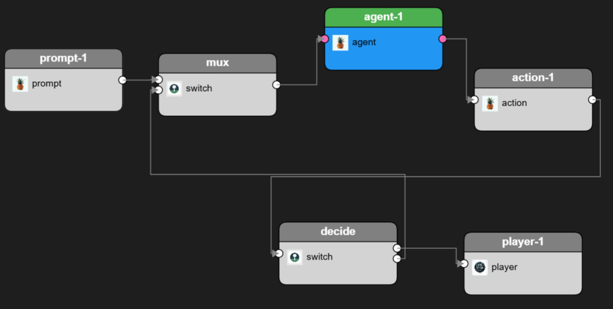

# 示例3：大语言模型循环流水线（llm\_loop 示例）

Pipeline见：[CantorAI Home]\GalaxyStudio\Examples\Pipelines



**案例描述**：`llm_loop.yml` 展示了一个与大语言模型 (LLM) 交互的闭环流水线。看名称推测这是一个“LLM代理循环”，即通过流水线不断产生提示(prompt)、让LLM回复，并根据回复采取行动(action)，再决定下一步。

从提供的 YAML 内容看，关键节点包括：

* **prompt-1**：类型 `prompt` 的过滤器。这可能负责生成或修改用户提示。无输入引脚，一个输出引脚 (Name: NewOutput)。意味着prompt-1会在开始时产生初始提示数据帧进入流水线。
* **agent-1**：类型 `agent` 的过滤器。这是LLM代理核心，负责调用大语言模型服务。parameters里出现 `url: ${pipeline.TestKey}` 和 `model: model12` 等。推测它调用一个远程LLM（也许OpenAI API或自托管模型）进行推理，输入是prompt，输出是LLM的文本回复。
* **action-1**：类型 `action`。可能用来根据LLM的回复执行某动作或生成新Prompt。这部分yaml没完全展示，但connections表明 action-1 输出又分两条路径：
* **decide**：有一个输入 (input)，两个输出 (output1, output2) 的 `switch` 类型过滤器。其描述提到每个输入帧会调用自定义逻辑决定往哪一个或多个输出pin发送。这 likely 实现了根据LLM回复内容做决策：output1 可能表示“满足条件，结束循环”，output2 表示“未满足，需继续”。
* **mux**：有两个输入 (input1, input2)，一个输出的 `switch` 类型过滤器。这个模块作用推测为合流：根据不同来源输入触发它再输出统一流。connections显示 prompt-1.output -> mux.input1，decide.output2 -> mux.input2。意味着初始prompt和来自decide的反馈都会进入mux，然后 mux 输出新的 prompt 送给 agent-1。
* **player-1**：在connections里decide.output1 -> player-1.input。说明 decide 的另一个输出(output1)直接进入 player-1 的 input，用于显示（player-1 在这个上下文可能是一个界面显示LLM最终结果的终端或UI组件）。这样，当decide判定会话完成，就把最终结果送到player显示并不再循环。

**循环逻辑**推断：prompt-1首先产生初始提示 -> mux转发给agent-1 -> agent-1调用LLM产出回复 -> output给action-1 -> action-1 可能基于回复执行某操作并生成决策依据 -> decide根据action/回复决定下一步：

* 如果需要继续对话/循环，则decide将可能修改后的 prompt发送 (output2) 回mux，从input2出去；
* 如果达到终止条件，则decide的output1触发player显示，并不发送继续prompt。
  Connections顺序：

```
prompt-1.output -> mux.input1
mux.output -> agent-1.input
agent-1.output -> action-1.input (Name: NewInput maybe)
action-1.output -> decide.input
decide.output2 -> mux.input2  (loop back)
decide.output1 -> player-1.input (final output)
```

- 还有 `agent-1.output -> action-1`（在 YAML 中有两行，可能对应两个引脚？其实 `agent-1` 只有一个输出，`action-1` 可能有两个输入引脚：一个可能是用于接收 agent 输出的 `"input"`，另一个可能是类似 `"context"` 的东西？不过 YAML 片段里 `action-1` 只是标注了 `type: action`，没有具体细节；在第 147 到 156 行的 connections 中可以看到 `agent-1.output` 同时连接到了 `action-1.NewInput` 和 `action-1.input`，重复出现。可能一个是内容输入，一个是参数注入。）不过，不管怎样，这是一个循环，其中 `decide` 要么输出给 `player`，要么回传给 `mux`。

CantorAI 的这种**复杂循环**通过 pipeline 能用相对简单的配置实现。上面推断那么多逻辑，其实用户可能通过Galaxy Studio拖几个节点连线就完成了，而框架负责异步处理LLM调用并循环。由于 LLM调用可能耗时几秒，Galaxy调度会确保在等待LLM时不会阻塞其它流水线部分。实际上，这里的模式类似**对话系统**：prompt生成问题->LLM回答->根据回答更新prompt->再问LLM，直到某条件结束（如达到轮次数或回答包含某关键词）。

**性能和扩展**：CantorAI pipeline可将不同Filter分散节点。例如LLM调用可以在网关节点执行，Action decide逻辑在边缘执行，从而减轻弱设备负担。

这个案例体现CantorAI流水线的**复杂逻辑表示能力**和**控制流**（通过条件、loop filter）。
